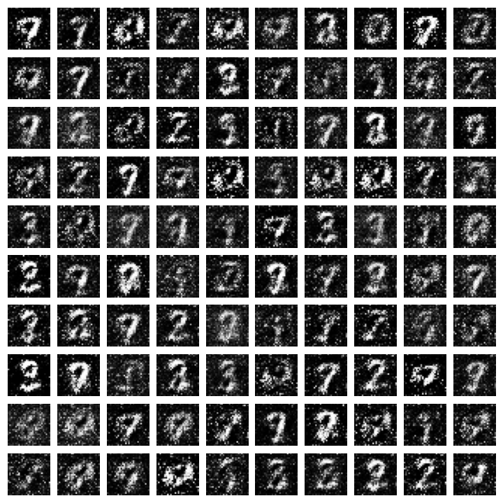
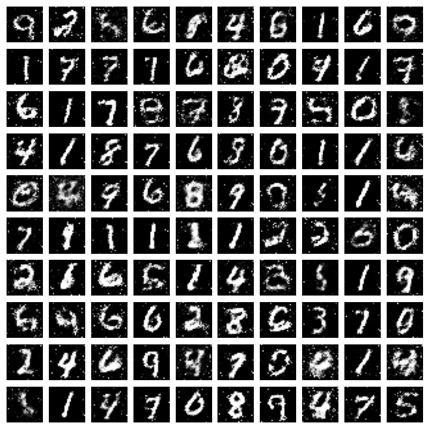
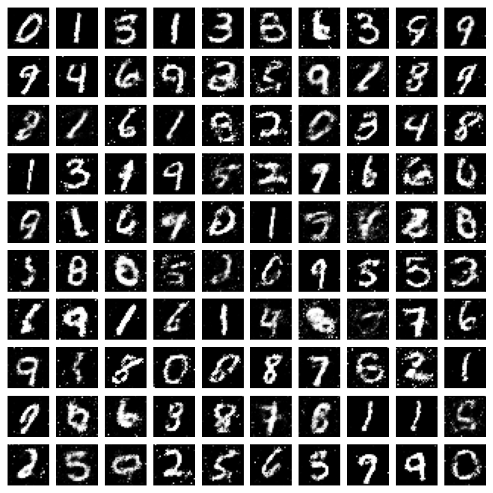
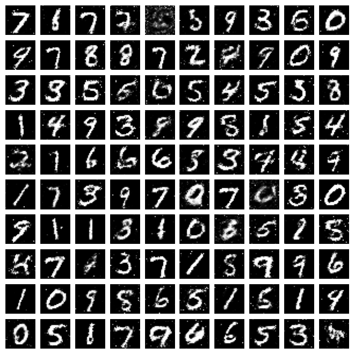

# MNIST-Image-Generation-with-GANs
Libraries used:
- Numpy
- Matplotlib
- Keras

Epoch 5:
>

>
>
Epoch 20
>

>
>
Epoch 35
>

>
>
Epoch 50
>

>
>
The quality of generated images can be improved with DCGANs. However, the MLP also performs quite well.
## Here is how the generated image looks when we use convolution in our GAN
>
Epoch 5:
>
/gan_output_epoch_5.png)
>
>
Epoch 20
>
/gan_output_epoch_20.png)
>
>
Epoch 35
>
/gan_output_epoch_35.png)
>
>
Epoch 50
>
/gan_output_epoch_50.png)
>
>
There is certainly very less noise in these images. Increasing the number of epochs might help in generating more accurate images though.